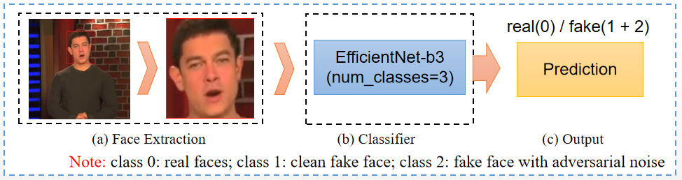
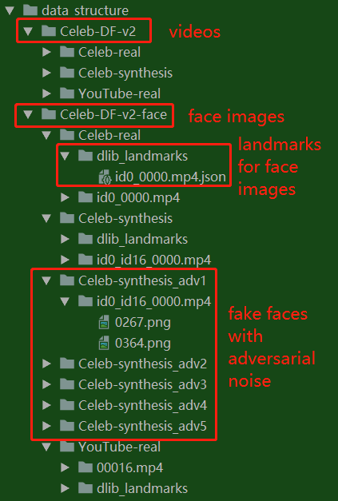
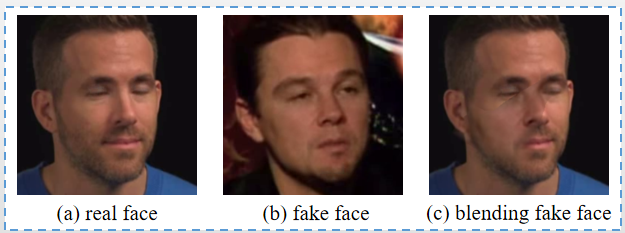

# DFGC Detection Solution
This repo provides an solution for the [DeepFake Game Competition (DFGC) @ IJCB 2021 Detection track](https://competitions.codalab.org/competitions/29583#learn_the_details). 
Our solution achieve the 1st in the sixth phase of the DFGC Detection track.
The ranking can be seen [here](https://competitions.codalab.org/competitions/29583#results)

## Technology Report Papers
[DFGC 2021: A DeepFake Game Competition](https://arxiv.org/pdf/2106.01217.pdf)

## Newly: code for [1st solution for DFGC2022](https://github.com/chenhanch/DFGC-2022-1st-place)

## Authors
Institution: Shenzhen Key Laboratory of Media Information Content Security(MICS)

Team name: Forensics_SZU  

Username: BokingChen
- [Han Chen](https://github.com/chenhanch) email:2016130205@email.szu.edu.cn
- [Baoying Chen](https://github.com/beibuwandeluori) email: 1900271059@email.szu.edu.cn
- [Yanjie Hu](https://github.com/zero-end)
- [Sili Li](https://github.com/szu-lisili)
- [Weilong Wu](https://github.com/wu-leaf)
- [Shenghai Luo](https://github.com/L-Icarus)
- [Long Zhuo](https://github.com/ZoloLongZhuo)
## Pipeline

## Training
### 1. Data Preparation
If you have any questions of data preparation, you can send an email to HanChen(2016130205@email.szu.edu.cn)
* 1.1 Extract Face Images and Facial Landmarks

To extract face images and save facial landmarks, you can refer to  "./data_preparation/extract_face/README.md"
* 1.2 Generate adversarial examples(Extended data created from Celeb-DF-v2, 
we only using train set for training)

To generate adversarial examples, you can refer to "./data_preparation/generate_adversarial/README.md",
or you can download the extended data(zip file, 3.63G) in 百度网盘(pan.baidu.com):

download link：https://pan.baidu.com/s/1YNO2kXX67EvQV3p145kk-g 
Extraction code(提取码)：1234 

After downloaded the zip file, you can unzip it and move it into "Celeb-DF-v2-face" directory,
the data structure can be seen as follow:
* 1.3 data structure sample: ./data_preparation/data_structure


### 2. Tricks 
#### 2.1 Data Augmentation
* Traditional: HorizontalFlip(), GaussNoise(p=0.1), GaussianBlur(p=0.1), 
* Self-supervised(one of key points of improvement): Blending real and fake faces(p=0.5).
Blending Demo can be seen as follow:


#### 2.2 Loss
* LabelSmoothing(smoothing=0.05)
#### 2.3 Balance class sampler by upsampling mode
* BalanceClassSampler(labels=xdl.get_labels(), mode="upsampling")
#### 2.4 Using fake faces with adversarial noise for training((one of key points of improvement))
* We training the model efficientnet-b3(pretrained in ImageNet) with 3 classes:
class 0: real faces; class 1: clean fake faces; class 2: fake faces with adversarial noise
*  class 0:class 1:class 2 = 4:1:3 per epoch 
* To predict images, we combine class 1 and class 2 into one class(fake faces)
```
outputs = nn.Softmax(dim=1)(model(imgs))
prediction = 1 - outputs[:, 0]
```
The prediction are the probability of testing images being fake,
in the range [0, 1], where 0 is real and 1 is fake
### 3. Start training
If you have any questions of starting training, you can send an email to Baoying Chen(1900271059@email.szu.edu.cn)
```bash
# you need to replace the "root_path" before running
python train_3c.py  
```
We randomly split 80% the train set for training and 20% for validation. 
During training phase, we verify the AUC of the validation set every 20 epochs, 
and save the model weight if it is improved. The model weights were saved in "./output/weights".
Finally, we select the model weight with the highest auc for submission

## Submission
* After training, you can move your best weights into "./submission_Det"
* replace weight name in line 105 of "./submission_Det/model.py" 
```
 model = TransferModel('efficientnet-b3', num_out_classes=3)
 model_path = os.path.join(thisDir, 'efn-b3_3c_60_acc0.9975.pth')  # you can replace it by your weight
 model.load_state_dict(torch.load(model_path, map_location='cpu'))
```
